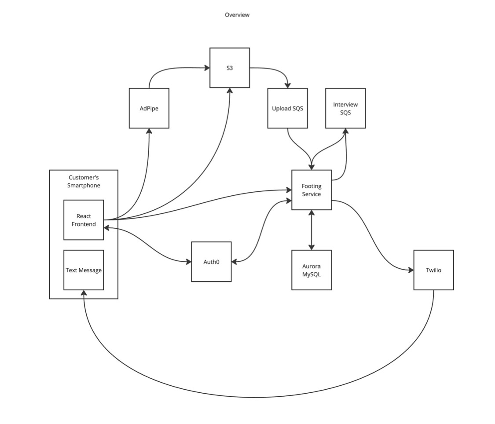

# Footing

**Footing** is the foundation of *MindBridge Health*, a platform designed to help families capture and preserve a lifetime of memories through scheduled interviews. Originally envisioned for aging seniors, it offers a meaningful way to preserve stories and promote memory health.

## 🌉 Why "Footing"?

A *footing* is the base on which a bridge stands. This service serves as the base for MindBridge Health—supporting the capture, storage, and retrieval of recorded interviews that span a lifetime.

## 🧠 Purpose

- **Emotional Keepsake**: Capture interview-style responses from loved ones to preserve memories.
- **Cognitive Health**: Encourage seniors to reflect on their lives to support memory function.
- **Legacy Building**: Provide families with a digital artifact that lives on.

## 💻 Tech Stack

- **Frontend**: React
- **Backend**: Kotlin (Footing Service)
- **Database**: Aurora MySQL
- **Authentication**: Auth0
- **Media**: AdPipe (video), Twilio (voice/SMS)
- **Messaging**: SQS (standard and FIFO for reliable processing)
- **Storage**: Amazon S3

## 📦 Architecture

The system is composed of multiple components working together to schedule and handle interviews:

- **Scheduling Workflow**: Customers receive SMS invitations, log in via Auth0, and schedule interviews.
- **Media Capture**: Video or phone interviews are handled via third-party integrations and uploaded for storage.
- **Messaging Reliability**: SQS ensures all scheduled interviews and media uploads are processed without loss.
- **Data Storage**: Metadata and schedules are stored in Aurora MySQL.



📷 Additional architecture diagrams are included in this repo in `/docs/Architecture.pdf` and showcase:

- Overall System Overview
- Initial Interview Flow
- Video Response Handling
- Phone Response Handling
- Uploading Additional Assets

## ⚙️ Local Setup

To run locally:

1. Clone this repo
2. Install Docker and Docker Compose
3. Set up `.env` variables (sample provided)
4. Start services:  
   ```bash
   docker-compose up --build
   ```
5. Requires a Twilio account to send/receive calls and SMS.

## 🚀 What This Project Demonstrates

- Clean architecture and separation of concerns
- Integration of multiple third-party systems
- Resilient and observable architecture using message queues
- Production-level SaaS thinking: auth, media, messaging, retries, and data modeling
